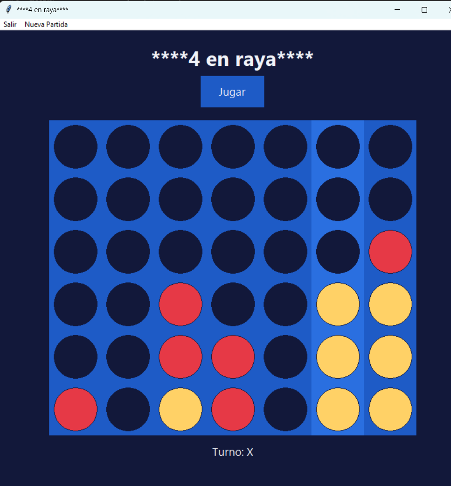

# 🔴🔵 4 en Raya

Juego clásico de **4 en raya** en Python con interfaz gráfica Tkinter. Juegas con las fichas rojas contra una **IA basada en minimax** que juega con las amarillas.

<p align="center">
  
</p>

## ✨ Características

- Interfaz gráfica con animación de caída de fichas.
- Rival controlado por IA (algoritmo minimax).
- Detección de victoria (horizontal, vertical y diagonales) y de empate.
- Resalta en verde las cuatro fichas ganadoras.
- Lógica del juego independiente de la interfaz y cubierta por tests.

## 📋 Requisitos

- Python 3.14
- Tkinter (incluido en la instalación estándar de Python para Windows)

## 🚀 Instalación y ejecución

```powershell
git clone <url-del-repositorio>
cd 4enRaya
python en_raya_4.py
```

El juego no necesita dependencias externas.

## 🎮 Cómo se juega

1. Pulsa **Jugar** (o **Nueva Partida** en el menú).
2. Haz clic en una columna: tu ficha cae hasta la casilla libre más baja.
3. Gana quien consiga **4 fichas en línea**: horizontal, vertical o diagonal.
4. Si el tablero se llena sin ganador, la partida termina en empate.

## 🧪 Tests

```powershell
python -m venv .venv
.\.venv\Scripts\Activate.ps1
pip install -r requirements.txt
python -m pytest
```

## 🗂️ Estructura del proyecto

```
4enRaya/
├── en_raya_4.py       # Punto de entrada
├── config.py          # Constantes y textos
├── juego.py           # Reglas: Ficha, Tablero, Partida (sin Tkinter)
├── ia.py              # Inteligencia artificial (minimax)
├── interfaz.py        # Interfaz gráfica (Tkinter)
├── tests/             # Tests con pytest
├── pytest.ini
├── requirements.txt
└── README.md
```

## 🧠 Arquitectura

- **Modelo** (`juego.py`): reglas y estado, sin dependencias de la interfaz.
- **IA** (`ia.py`): calcula la mejor jugada a partir del tablero.
- **Vista** (`interfaz.py`): dibuja el tablero y gestiona los clics.
- **Configuración** (`config.py`): tamaño del tablero, fichas para ganar y mensajes.
